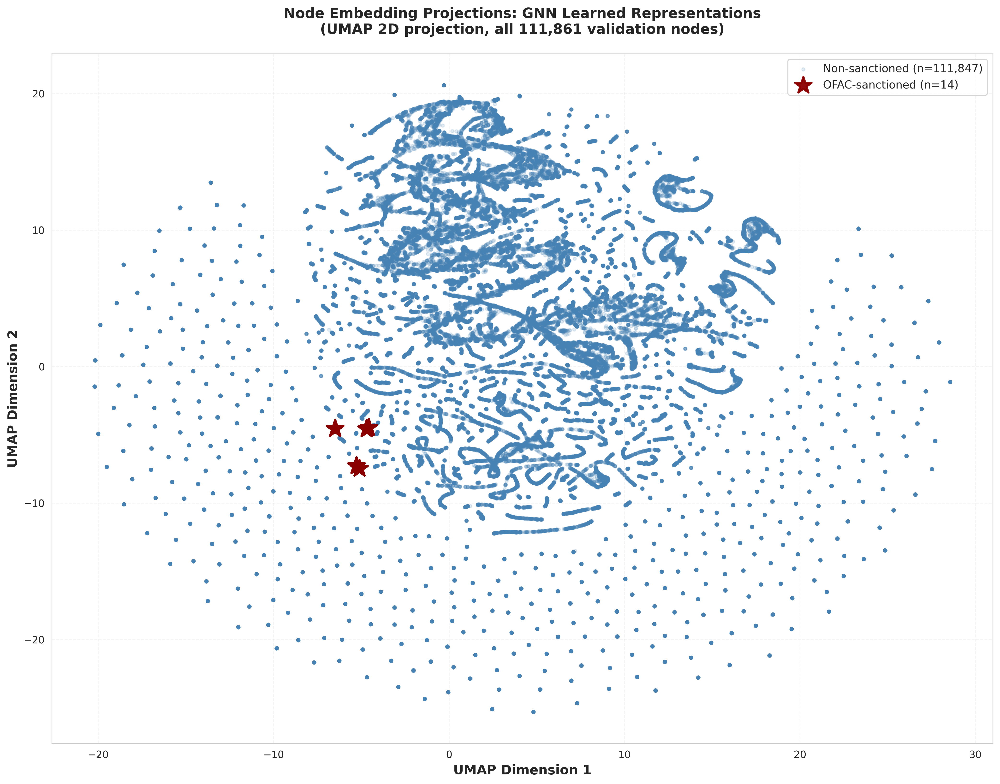
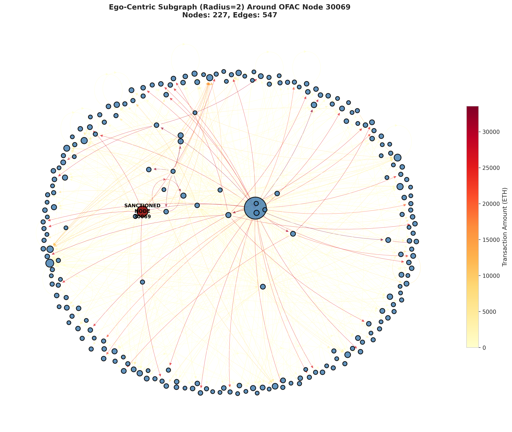
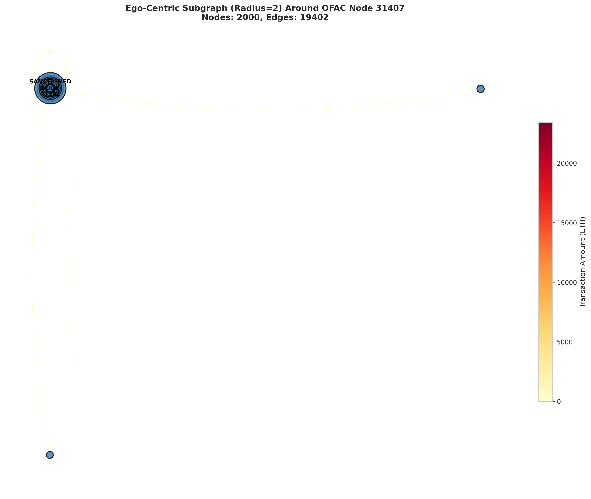
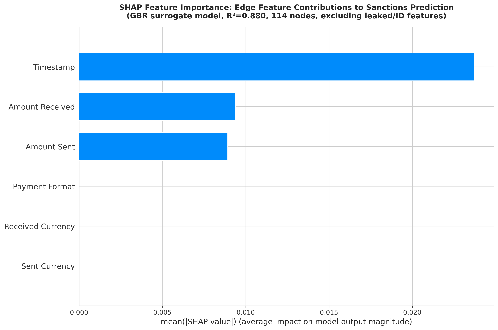
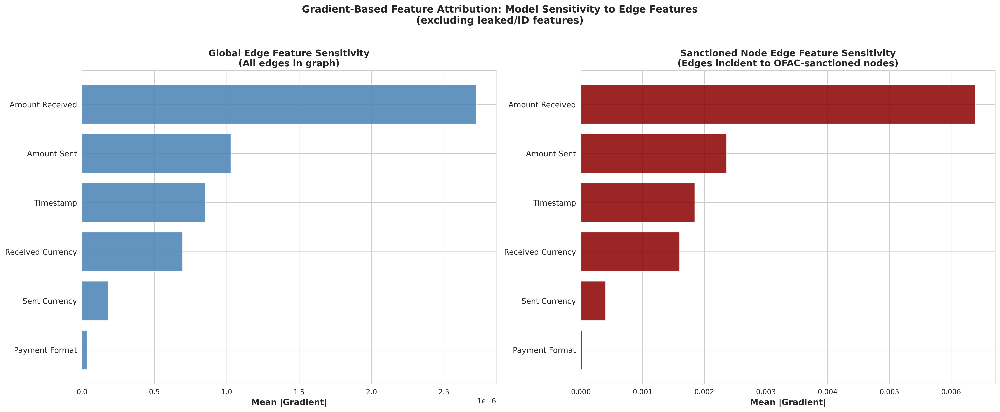
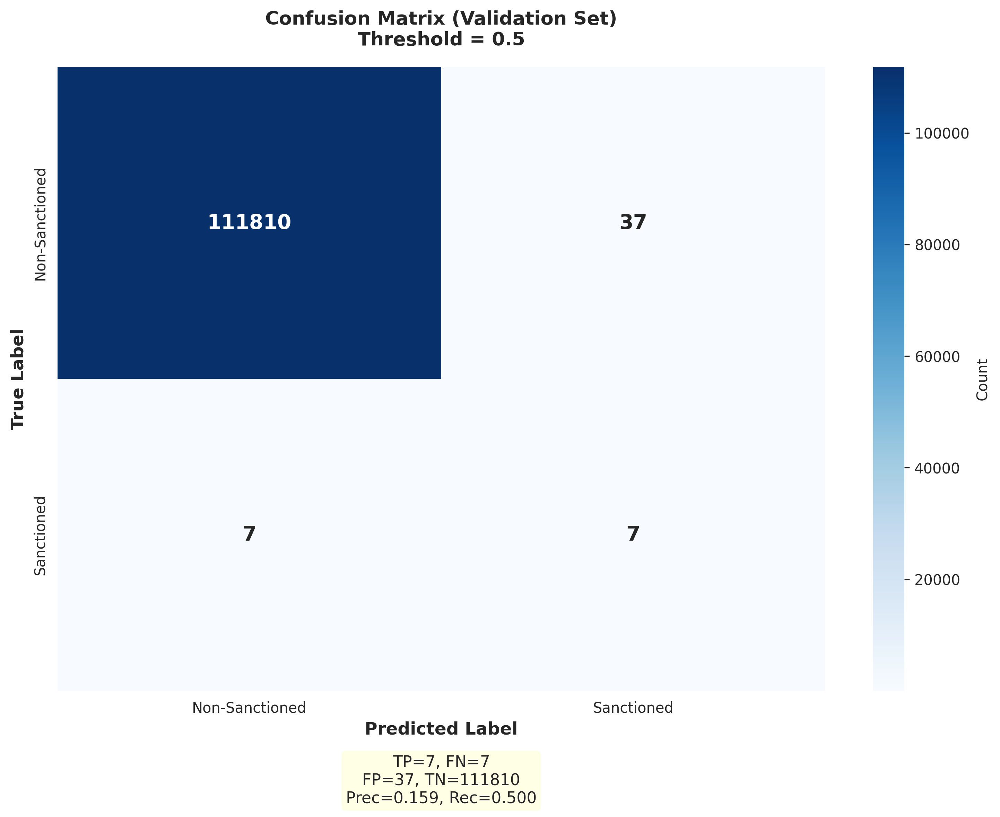
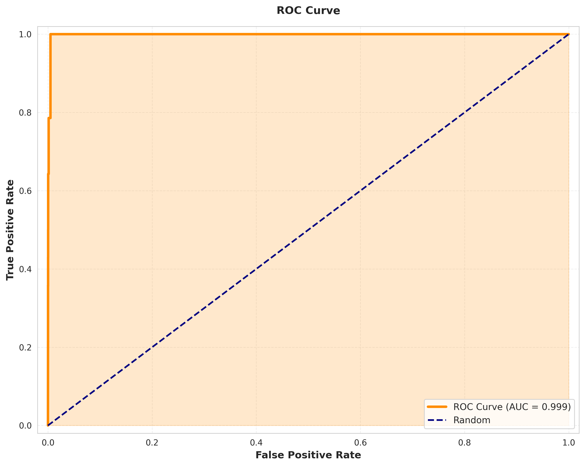
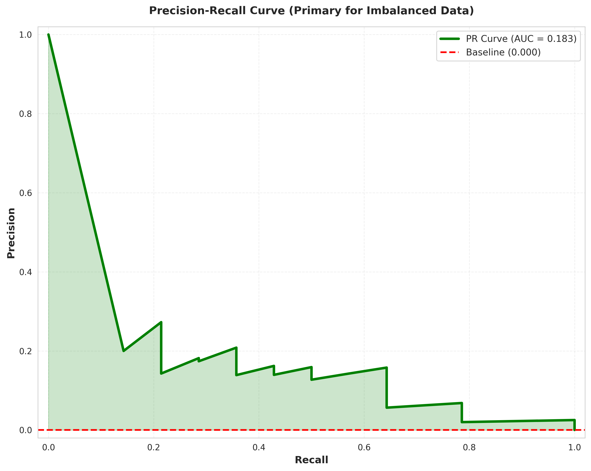

# Data Visualization: Ethereum AML GNN

Visualizations generated by the `AML_Visualizations_Production.ipynb` notebook for the NodeGINe GNN model trained on Ethereum transaction data for OFAC sanctions detection.

**Data Source:** Processed outputs from `Data-Modeling/` pipeline (`formatted_transactions.parquet`, `node_labels.parquet`, trained model checkpoint).

**Dataset:** 889,615 nodes, 23,082,561 edges, 69 OFAC-sanctioned addresses.

---

## Visualization 1: Node Embedding Projections (UMAP)

UMAP 2D projection of learned node embeddings from the penultimate GNN layer. Sanctioned nodes (red stars) cluster in the bottom-left, separated from 111,847 benign validation nodes — evidence the GNN learned a meaningful, separable representation.

---

## Visualization 2: Ego-Centric Subgraphs Around Sanctioned Addresses

1–2 hop transaction neighborhoods around OFAC-sanctioned nodes. Node size reflects in-degree; edge color encodes transaction amount (ETH). Four representative sanctioned addresses shown:

### Node 17180 (1,165 nodes, 11,471 edges)
Dense neighborhood with the sanctioned node at the center, revealing high-connectivity hub behavior.

### Node 30069 (227 nodes, 547 edges)
Clearest hub-spoke structure. Sanctioned node labeled on the left; edge colors show higher-value transactions (red/orange) radiating outward.

### Node 31407 (2,000 nodes capped, 19,402 edges)
Large neighborhood capped at 2,000 highest-degree nodes. Spectral layout separates the sanctioned node from peripheral clusters.

### Node 33831 (2,000 nodes capped, 13,561 edges)
Dense, uniformly connected neighborhood — sanctioned node embedded deeply within a high-degree cluster.

---

## Visualization 3: Temporal Evolution of Transaction Graph

10 evenly-spaced weekly snapshots showing the largest connected component at each time window. Node size is proportional to degree; red nodes indicate sanctioned addresses.

---

## Visualization 4: Feature Importance & Model Decisions

### 4a: SHAP Feature Importance (Surrogate Model)

SHAP values from a GBR surrogate (R²=0.987) fitted to the GNN's predictions, using aggregated edge features per node. `Is Laundering` dominates — a known label leakage from the IBM AML-HI dataset that should be addressed in future work.

### 4b: Gradient-Based Edge Feature Attribution

Direct gradient backpropagation through the GNN to raw edge features. Left panel shows global sensitivity; right panel shows sensitivity on edges incident to sanctioned nodes. Both confirm `Is Laundering` dominance with `Amount Received` as the strongest legitimate feature.

---

## Visualization 5: Evaluation Metrics

### 5a: Confusion Matrix (Threshold = 0.5)

TP=7, FN=7, FP=37, TN=111,810. The model catches 50% of sanctioned nodes (recall=0.500) with precision=0.159 under extreme class imbalance (14 positives vs 111,847 negatives).

### 5b: ROC Curve

AUC=0.999. Near-perfect ROC is expected but misleading under extreme imbalance — even small FPR translates to many false positives at this scale.

### 5c: Precision-Recall Curve

PR-AUC=0.183 — the most honest metric for this imbalanced setting. The model meaningfully outperforms the random baseline (0.000) but precision degrades as recall increases.

---

## References

- Elmougy & Liu (2023): Elliptic++ dataset multi-view graph work
- Morris et al. (2019): GNN expressiveness and 1-WL algorithm
- SHAP: Lundberg & Lee (2017)
